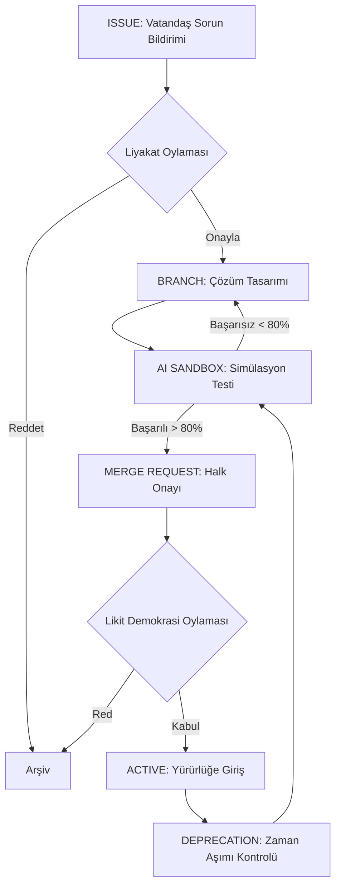

# 🏛️ Açık Kamu Protokolü (`AKP`) v1.0

> **"Devlet bir otorite değil, toplumun ortak aklını çalıştıran açık kaynaklı bir işletim sistemidir."**

**Açık Kamu Protokolü (AKP)**, devlet geleneğini hantallıktan kurtaran, ancak egemenlik hakkına ve vatandaşın demokratik iradesine sonuna kadar saygılı bir yapı sunar. Hantal, bürokratik ve kapalı kapılar ardında işleyen yüzlerce yıllık devlet geleneğini tamamen reddeden; yerine veriye, liyakate ve kitle kaynaklı (crowdsourced) katılıma dayanan yeni nesil bir **Kamu İşletim Sistemi** mimarisidir.

---

## 🧠 Felsefe: Ortak Akıl ve Radikal Şeffaflık

Geleneksel sistemlerde karar alma mekanizmaları dar bir azınlığın tekelindedir. AKP'de ise devlet, bir "hizmet sağlayıcı" ve "moderatör" konumundadır. Sorunları çözen asıl güç **Ortak Akıl** ağıdır.

*   **Radikal Şeffaflık:** Güvenlik ve mahremiyet vatandaşa, mutlak şeffaflık ise devlete aittir. Kamunun her kuruşu, her kararı ve her algoritması halkın denetimine açıktır.
*   **Egemenlik ve Güven Karşılığı:** Devletin asli egemenliği, dijitalleşme ile zayıflamaz; aksine sistemin şeffaf ve hesap verebilir olmasıyla halk nezdinde daha güçlü bir meşruiyet kazanır. Egemenlik hakkı, algoritmaların değil, algoritmalara yön veren halkın iradesindedir.
*   **Liyakat Temelli Katılım:** Sesin yüksekliği değil, bilginin derinliği kritiktir. Sistem, uzmanlığı ve toplumsal katkıyı algoritmik olarak ödüllendirir.

---

## 🛰️ Sistem Mimarisi (Visual Overview)

Açık Kamu Protokolü'nün nasıl işlediğini anlamak için temel yasama döngüsüne göz atın:

---

## 🛠️ Çekirdek Protokoller (Core)

Protokolün üzerine inşa edildiği, değiştirilemez 5 temel kural:

1.  **[Kanıtlanmamış Yasa Yasaktır](core/LEGISLATION_ENGINE.md):** Hiçbir mevzuat, AI simülasyon motorlarında test edilmeden yürürlüğe giremez. %80 olumlu fayda sağlamayan kural otomatik olarak reddedilir.
2.  **[Zımni Kabul ve Bürokratik Timeout](core/LEGISLATION_ENGINE.md#2-zımni-kabul-ve-biyometrikalgoritmik-zaman-aşımı):** Kamu, vatandaşın talebine belirlenen sürede (örn: 48 saat) yanıt vermezse, sistem işlemi vatandaş lehine **otomatik onaylar**.
3.  **[Açık Defter Şeffaflığı](core/OPEN_LEDGER.md):** Devletin tüm ekonomik faaliyetleri blokzinciri mantığıyla halka açıktır. Ticari veya bürokratik sır kavramı kamu harcamalarında geçersizdir.
4.  **[Dinamik Ömür](core/LEGISLATION_ENGINE.md#3-dinamik-ömür-deprecation-of-laws):** Sonsuz geçerliliğe sahip yasa olamaz. Sisteme giren her mevzuatın bir "son kullanma tarihi" vardır ve süre sonunda fayda testine girer.
5.  **[Ortak Akıl ve Açık Katılım](governance/GOVERNANCE.md):** Her vatandaş veya uzman grubu, kamunun iyileştirilmesi için sisteme doğrudan mevzuat değişikliği (Pull Request) önerebilir.

---

## 📦 Modüler Kamu Yapısı

Geleneksel bakanlıklar yerine, birbiriyle API'ler üzerinden konuşan 4 ana modül:

| Modül | Amaç | İşleyiş | Dokümantasyon |
| :--- | :--- | :--- | :--- |
| **İnsan Gelişimi** | Bireysel Kapasite | Kişiselleştirilmiş Eğitim & Proaktif Sağlık | [İncele](modules/HUMAN_DEVELOPMENT.md) |
| **Sistem & Altyapı** | Fiziksel Senkronizasyon | IoT Tabanlı Otonom Şehir & Enerji Yönetimi | [İncele](modules/INFRASTRUCTURE.md) |
| **Ekonomi & İnovasyon**| Adil Zenginlik Dağıtımı | Algoritmik Vergilendirme & Vatandaş Fonu | [İncele](modules/ECONOMY.md) |
| **Adalet & İç Denge** | Toplumsal Ahenk | Akıllı Sözleşmeler & Dijital Tahkim | [İncele](modules/JUSTICE.md) |

---

## 🔍 Alt Sistemler ve Derinlik

Sistemin "kaputun altındaki" çalışma prensiplerini inceleyin:

### 1. Likit Demokrasi ve Liyakat (Proof of Competence)
Genel yaşam kalitesi kararlarında herkesin oyu eşittir. Ancak teknik konularda (örn: nükleer enerji), doğrulanmış uzmanlığı olan vatandaşların oyu algoritmik olarak daha ağırlıklıdır.

### 2. Akıllı Vergi Yönlendirmesi (Smart Taxation)
Toplanan verginin %50'si vatandaşın seçtiği alanlara (Uzay Arş., Temiz Su, Ar-Ge vb.) doğrudan yönlendirilir. Devlet, bütçeyi halkın vizyonuna göre şekillendirmek zorundadır.

### 3. Merkeziyetsiz Kimlik (DID)
Vatandaşlar plastik kartlar taşımaz. Haklar ve liyakat puanları şifrelenmiş dijital cüzdanlardadır. Sistem "Sıfır Bilgi İspatı" (ZKP) ile çalışır; devlet bilgiyi depolamaz, sadece doğruluğunu teyit eder.

---

## 🧪 Geliştirici Araçları

-   **Veri Yapıları:** [JSON Schemas](schemas/) (Law, DID, Proposal)
-   **Simülasyon Motoru:** [Python Validator](simulations/legislation_validator.py)
-   **Yönetişim Planı:** [Likit Demokrasi ve Liyakat](governance/GOVERNANCE.md)

---

## 🚀 Başlangıç ve Çağrı (Contributing)

Sistemin şikayet ederek düzelmeyeceğine inanan herkesi sistemi yeniden yazmaya davet ediyoruz. Açık Kamu Protokolü, toplumun kolektif dehasına inanır.

1.  Yeni bir modül fikriniz mi var? **Issue** açın.
2.  Süreçlerde bir "bug" mı buldunuz? **Pull Request** gönderin.
3.  Detaylar için [Katkı Kılavuzu'nu (Contributing)](CONTRIBUTING.md) okuyun.

---

> **Açık Kamu Protokolü, toplumun kolektif dehasına inanır. Kodla, Paylaş, Yönet.**